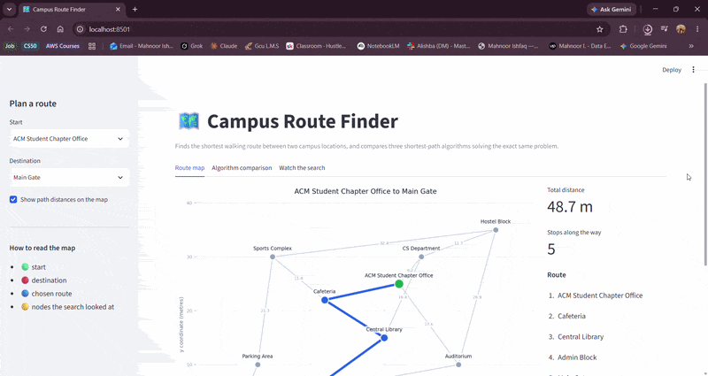
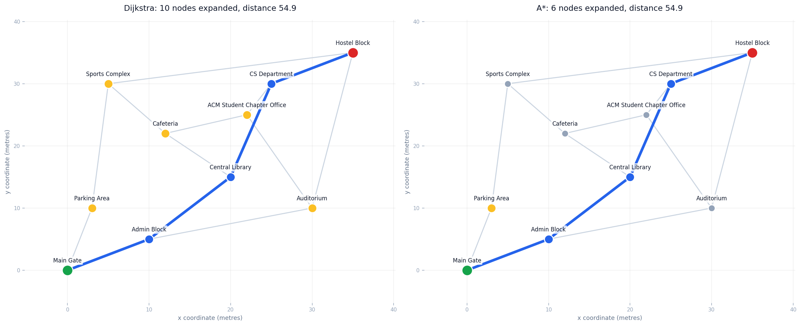
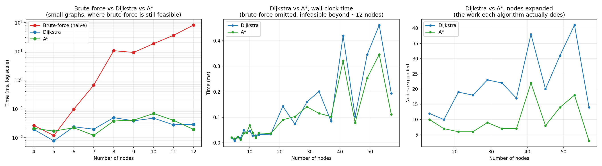

# 🗺️ Campus Route Finder

Finds the shortest walking route between two campus locations, and shows *why* you would use a real shortest-path algorithm instead of the naive one, with a measured benchmark rather than a claim.

  




*Pick two locations and the shortest route is drawn on the campus map. The slider replays the search node by node.*

## 🎯 Problem

Finding the shortest path between two points sounds simple, but the naive way to solve it, trying every possible route and keeping the cheapest, gets unusably slow as the map grows. This project implements that naive approach alongside two real algorithms (Dijkstra and A\*) on the same campus map, and measures the difference.

## ✨ What the app does

- **Visual campus map.** Locations are plotted at their real coordinates, walking paths are drawn as edges, and the chosen route is highlighted.
- **Pick any two locations** from the dropdowns and get the route, the total distance, and the stops along the way.
- **Side-by-side algorithm comparison.** All three algorithms run on your chosen route, and you see the distance, nodes expanded, and time for each.
- **Step through the search.** A slider replays the search one node at a time, so you can watch A\* head straight for the destination while Dijkstra spreads out in every direction.

## 🧩 How it works

Three algorithms solve the same problem on the same graph:

| Algorithm | Approach | Worst-case time |
|---|---|---|
| **Brute-force (naive)** | DFS enumerates every simple path between source and destination, keeps the cheapest | O(V!) |
| **Dijkstra** | Binary-heap priority queue, always expands the currently cheapest node | O((V + E) log V) |
| **A\*** | Dijkstra plus a heuristic (straight-line distance between campus coordinates) that steers the search toward the goal instead of expanding outward in every direction | O((V + E) log V), but expands far fewer nodes in practice |

The campus map (`data/campus_map.json`) models 10 locations (Main Gate, Library, CS Department, Hostel, and so on) as nodes, with walking paths as weighted edges.

On the sample route (Main Gate to Hostel Block) all three agree the shortest distance is **54.90**, but **A\* expands 6 nodes to find it, Dijkstra expands 10, and brute-force expands 68.** That gap is the point, and it is easier to see than to describe:



Yellow marks every location the search had to look at before it was sure. Both algorithms return the identical route in blue, but Dijkstra had to check the Sports Complex, the Cafeteria, and the Auditorium to get there, while A\* walked almost straight to the answer. Regenerate this with `python generate_search_comparison.py`.

## 🐛 A real bug I found and fixed: the heuristic was inadmissible

A\* is only guaranteed to return the optimal path if its heuristic never *overestimates* the remaining cost. Because the heuristic here is straight-line distance, that holds only when no edge weight is shorter than the straight line between its two endpoints.

When I checked, **11 of the 14 edges in my original map violated this.** For example, the Admin Block to Central Library edge had a weight of 12.8 while the straight-line distance between those coordinates is 14.14. A walking path cannot be shorter than a straight line, so the data was physically impossible, and A\* was not actually guaranteed to be correct on this map. It happened to return the right answer, but by luck rather than by guarantee.

Two things came out of the fix:

1. Every edge weight in `campus_map.json` was corrected so it is at least the straight-line distance between its endpoints. The random graph generator used for benchmarking had the same problem, caused by rounding weights down to two decimal places, and was fixed too.
2. `tests/test_algorithms.py` now asserts admissibility for the campus map, the benchmark graphs, and the test fixture, so this cannot silently come back. There is also a test that brute-force, Dijkstra, and A\* agree on the cost for **all 100 pairs** of campus locations, not just one.

## 📊 Benchmark, measured not estimated

All three algorithms were run on randomly generated graphs from 4 to 57 nodes, timed with `time.perf_counter()`. Each measurement is the **median** of 25 runs, because these operations are fast enough that a single OS scheduling hiccup can be bigger than the thing being measured, and one outlier would drag a mean well off the real cost. Full methodology is in `src/benchmark.py` and reproducible by running it yourself.



**Left, log scale:** brute-force goes from 0.03 ms at 4 nodes to **147 ms at just 12 nodes**, roughly 5000x slower for a 3x increase in graph size, which is what O(V!) predicts. Dijkstra and A\* barely move.

**Middle:** brute-force is excluded past 12 nodes because it becomes impractical to run at all, and that omission is itself the finding. Dijkstra and A\* both stay well under a millisecond even at 57 nodes.

**Right, and this is the more honest comparison:** at these sizes the wall-clock gap between Dijkstra and A\* is small and partly buried in timing noise, because computing the heuristic costs something too. Nodes expanded is the cleaner signal, and there A\* wins consistently and by a wide margin.

| Nodes | Brute-force | Dijkstra | A\* |
|---|---|---|---|
| 4 | 0.027 ms | 0.015 ms | 0.018 ms |
| 8 | 7.23 ms | 0.044 ms | 0.028 ms |
| 12 | 147 ms | 0.044 ms | 0.032 ms |
| 57 | *(not run, infeasible)* | 0.154 ms | 0.095 ms |

Nodes expanded, the metric that is not noise-limited:

| Nodes | Dijkstra | A\* |
|---|---|---|
| 21 | 19 | 6 |
| 33 | 22 | 7 |
| 45 | 20 | 8 |
| 57 | 14 | 3 |

Reproduce it yourself: `python generate_chart.py`

## ⚙️ Tech Stack

- Python 3.10+
- Streamlit (web app)
- matplotlib (map rendering and benchmark chart)
- pytest (tests)

## 🗂️ Project Structure

```
campus-route-finder/
├── app.py                         # Streamlit app (the visual front end)
├── main.py                        # CLI demo, finds a route on the sample map
├── generate_chart.py              # Regenerates docs/benchmark_chart.png
├── generate_search_comparison.py  # Regenerates docs/search_comparison.png
├── requirements.txt
├── data/
│   └── campus_map.json            # Sample campus graph (10 locations)
├── docs/
│   ├── demo.gif
│   ├── benchmark_chart.png
│   ├── search_comparison.png
│   └── search-comparison.gif
├── src/
│   ├── graph.py                   # Graph model, JSON loader, random graph generator
│   ├── result.py                  # SearchResult returned by every algorithm
│   ├── plotting.py                # Draws the campus map with matplotlib
│   ├── benchmark.py               # Timing harness across increasing graph sizes
│   └── algorithms/
│       ├── brute_force.py         # Naive DFS enumeration, O(V!)
│       ├── dijkstra.py            # Heap-based Dijkstra, O((V+E) log V)
│       └── astar.py               # A* with Euclidean heuristic
└── tests/
    └── test_algorithms.py
```

Every algorithm returns the same `SearchResult`: the path, its cost, how many nodes were expanded, and the order they were expanded in. That last field is what the app replays in the step-through view.

## 🚀 Running it locally

```bash
git clone https://github.com/mahnoorishfaq/campus-route-finder.git
cd campus-route-finder
python -m venv venv
venv\Scripts\activate        # Windows
source venv/bin/activate     # macOS/Linux
pip install -r requirements.txt

streamlit run app.py          # the web app
python main.py                # CLI version
pytest -v                     # run the tests

python generate_chart.py             # regenerate the benchmark chart
python generate_search_comparison.py # regenerate the Dijkstra vs A* map
```

## ☁️ Deploying to Streamlit Community Cloud

1. Push this repository to GitHub.
2. Go to [share.streamlit.io](https://share.streamlit.io) and sign in with GitHub.
3. Click **New app**, pick this repository, set the main file to `app.py`, and deploy.
4. Streamlit installs from `requirements.txt` automatically. First build takes a couple of minutes.
5. Paste the resulting URL into the **Live demo** line at the top of this README.

## 🗺️ Known Limitations

- The campus map is a small hand-modeled sample of 10 locations, not pulled from a real GIS dataset. Coordinates and walking distances are approximate.
- The benchmark uses randomly generated graphs for scale testing, since a real campus map of 50+ nodes was not available. That is noted here rather than presented as real-world data.
- At these graph sizes the Dijkstra vs A\* wall-clock difference is close to measurement noise. Nodes expanded is the more meaningful comparison and is reported alongside it.
- Routes are static. There is no time-of-day weighting, accessibility routing, or handling of paths that are closed.

## 👤 Author

**Mahnoor Ishfaq**, final-year BS AI student, GCU Lahore
[GitHub](https://github.com/mahnoorishfaq)
